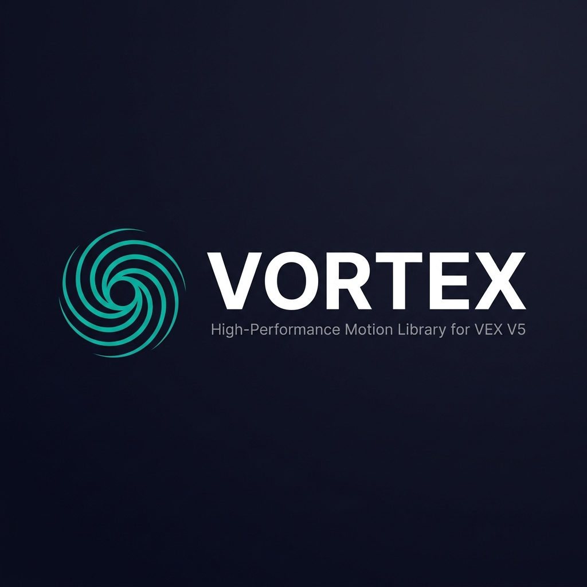
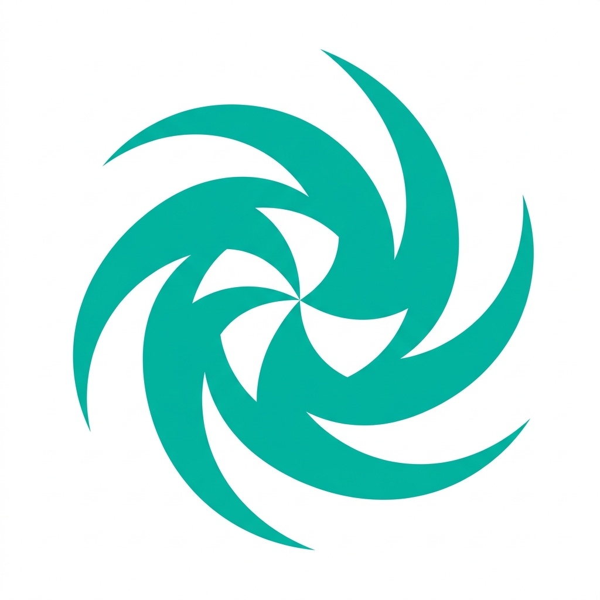

<p align="center">
  
</p>

<p align="center">
  <strong>High-Performance Motion Library for VEX V5</strong>
</p>

<p align="center">
  <a href="https://github.com/jonahchang207/Vortex/releases"></a>
  <a href="https://github.com/jonahchang207/Vortex/blob/main/LICENSE"></a>
  <a href="https://github.com/jonahchang207/Vortex/stargazers"></a>
  <a href="https://github.com/jonahchang207/Vortex/issues"></a>
  <a href="https://jonahchang207.github.io/Vortex/"></a>
</p>

---

## What is Vortex?

**Vortex** is a professional-grade, open-source motion control library built on top of [PROS](https://pros.cs.purdue.edu/) for VEX V5 robots. It provides everything needed for precise autonomous routines and buttery-smooth driver control — from advanced path-following algorithms to real-time telemetry and a polished on-brain GUI.

Vortex is designed to **meet or exceed** the functionality of industry-standard templates like [LemLib](https://github.com/LemLib/LemLib) and [EZ-Template](https://github.com/EZ-Robotics/EZ-Template), while offering a cleaner, more modular architecture.

---

## ✨ Features

<table>
<tr>
<td width="50%" valign="top">

### 🧭 Motion Algorithms
- **Boomerang (`moveToPose`)** — Navigate to a point while arriving at a specific heading
- **Pure Pursuit (`follow`)** — Follow pre-generated paths with configurable lookahead
- **Point-to-Point (`moveToPoint`)** — Move to any (x, y) coordinate on the field
- **Shortest-Path Turning** — Automatic CW/CCW selection
- **Swing Turns** — Lock one side of the drivetrain

### ⚙️ Control Systems
- **PID** with anti-windup, slew rate, and exit conditions
- **Trapezoidal Velocity Profiling** — Smooth accel/decel
- **Motion Chaining** — Maintain speed between movements via `min_speed`
- **Active Braking** — PID-based position hold after moves

</td>
<td width="50%" valign="top">

### 🏎️ Driver Control
- **Arcade / Tank / Curvature** drive modes
- **Steering Desaturation** — Prioritizes turning at full throttle
- **Exponential Drive Curves** — Fine-grained joystick control
- **PTO Support** — Dynamically reassign motors

### 🛠️ Utilities
- **LVGL Auton Selector** with Red/Blue Alliance toggle
- **NPR-Style Loading Screen** with IMU calibration feedback
- **Real-time Telemetry** via serial plotter (`>Name:Value`)
- **Non-blocking Timers** and **EMA Filters**
- **Pneumatic Piston Wrapper** (`extend`, `retract`, `toggle`)

</td>
</tr>
</table>

---

## 🚀 Ultimate Installation (Depot)

For the easiest experience, add the Vortex depot to your PROS environment. This allows you to install and update Vortex with a single command.

### 1. Add the Depot
Run this once to link Vortex to your PROS CLI:
```bash
pros c add-depot Vortex https://raw.githubusercontent.com/jonahchang207/Vortex/depot/stable.json
```

### 2. Install Vortex
In your project directory, run:
```bash
pros c apply vortex
```

### 3. Update Vortex
To get the latest version later:
```bash
pros c apply vortex --update
```

---

## 🛠 Manual Installation
If you prefer not to use the depot:
1. Download the latest `vortex@x.x.x.zip` from the [Releases](https://github.com/jonahchang207/Vortex/releases) page.
2. In your project directory, run:
   ```bash
   pros c apply vortex@x.x.x.zip
   ```

### 2. Configure

```cpp
#include "vortex/vortex.hpp"

auto left  = std::make_shared<pros::MotorGroup>({1, -2, 3});
auto right = std::make_shared<pros::MotorGroup>({-4, 5, -6});

vortex::Chassis chassis({
    .left_motors    = left,
    .right_motors   = right,
    .track_width    = 12.5,
    .wheel_diameter = 3.25,
    .rpm            = 450,
    .odom_sensors   = {
        .vertical1 = std::make_shared<vortex::TrackingWheel>(10, 2.75, 0),
        .imu       = std::make_shared<pros::Imu>(20)
    }
});
```

### 3. Drive

```cpp
void autonomous() {
    // Boomerang to a pose
    chassis.moveToPose(24, 24, 90, 3000);

    // Chain movements without stopping
    chassis.moveToPoint(48, 0, 2000, {.min_speed = 60});
    chassis.moveToPoint(0, 0, 2000);
}

void opcontrol() {
    pros::Controller master(pros::E_CONTROLLER_MASTER);
    while (true) {
        chassis.curvature(
            master.get_analog(ANALOG_LEFT_Y),
            master.get_analog(ANALOG_RIGHT_X)
        );
        pros::delay(20);
    }
}
```

---

## 📖 Documentation

Full API reference, tutorials, and guides are available at:

### **[jonahchang207.github.io/Vortex](https://jonahchang207.github.io/Vortex/)**

| Section | Description |
|---|---|
| [Getting Started](https://jonahchang207.github.io/Vortex/getting-started/installation/) | Installation and chassis configuration |
| [Tutorials](https://jonahchang207.github.io/Vortex/tutorials/pid-tuning/) | PID Tuning, Motion Algorithms, Driver Control |
| [API Reference](https://jonahchang207.github.io/Vortex/api/chassis/) | Full class and method documentation |

---

## 🏗️ Project Structure

```
Vortex/
├── include/vortex/
│   ├── drive/          # Chassis, Odometry
│   ├── control/        # PID, Trapezoidal Profile
│   └── util/           # Logger, Timer, Piston, Math, GUI
├── src/vortex/
│   ├── drive/
│   │   ├── chassis/    # One file per method (atomic)
│   │   └── odom/       # One file per method (atomic)
│   ├── control/pid/    # One file per method (atomic)
│   └── util/           # GUI, Math, Logger
├── docs/               # MkDocs documentation source
└── src/main.cpp        # Example usage
```

> Every class method lives in its own `.cpp` file for maximum modularity and parallel compilation.

---

## 📊 GitHub Stats

<p align="center">
  
</p>

---

## 🤝 Contributing

Contributions are welcome! Please:

1. Fork the repository
2. Create a feature branch (`git checkout -b feature/my-feature`)
3. Commit your changes (`git commit -m 'Add my feature'`)
4. Push to the branch (`git push origin feature/my-feature`)
5. Open a Pull Request

---

## 📄 License

This project is licensed under the **MIT License** — see the [LICENSE](LICENSE) file for details.

---

<p align="center">
  
  <br/>
  <sub>Built with ❤️ for the VEX Robotics community</sub>
</p>
